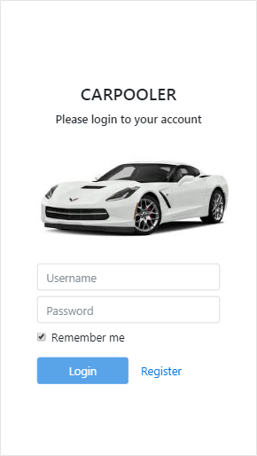
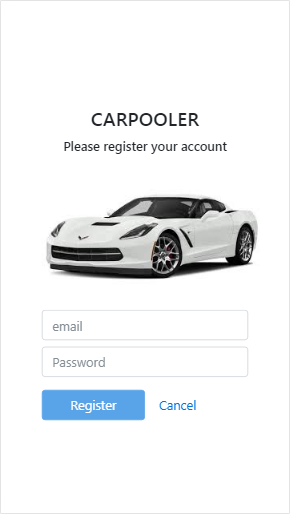
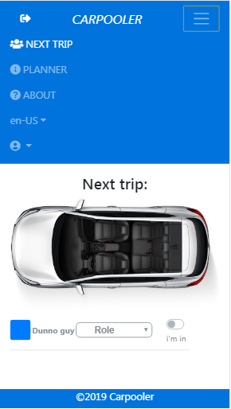
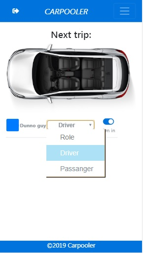
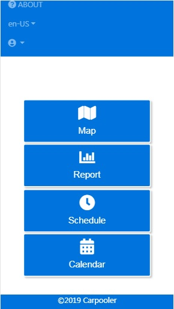
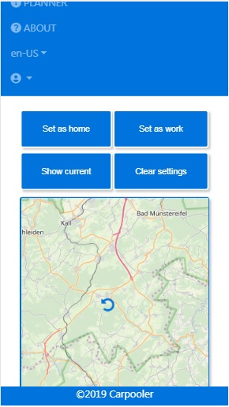
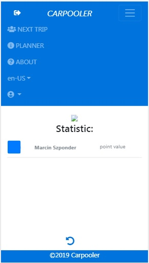
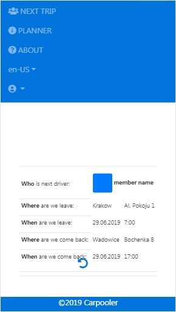
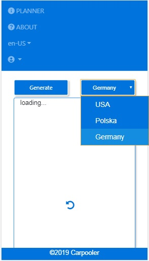

# Carpooler

This app is used to share a car for regular trips, for example commuting to work

First of all you have to register your account, therefore please go to the Register button at the bottom of the app

Provide your email address and password

After registration you will be redirected to the carpooler next trip page, next time you can access the app with your credentials

Here you can set your role and presence in the nearest trip

At the right upper corner you cna find Menu button wchic allows you go to the application menu

Here you can go to the Planner section, read About application, switch language from EN to FR and logout if you wish

In the Planner section you can go to the Map, Report, Schedule and Calendar

The Map page shows map of your location base on GPS coordinates captured from your device. You can set as home, set as work, show current and clear settings

Teh Report page shows your statistic base on roles you had in the trips you've done

In the Schedule you can see nearest trip parameters

In the Calendar you can check the holidays in USA, Germany in Poland.

